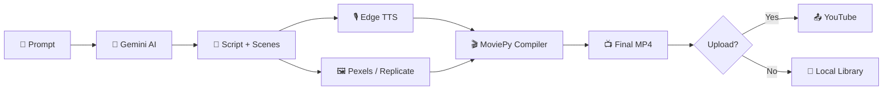

<div align="center">

# 🎬 Helios Studio

### AI-Powered YouTube Shorts Video Generator & Automation Platform

[](https://fastapi.tiangolo.com/)
[](https://react.dev/)
[](https://vitejs.dev/)
[](https://ai.google.dev/)
[](https://developers.google.com/youtube)

*Generate scripts, compile videos, and publish YouTube Shorts — all from one local desktop app.*

---

</div>

## ✨ Features

| Feature | Description |
|---|---|
| **🤖 AI Script Generation** | Gemini-powered script writing with hook optimization, scene breakdown, and subtitle generation |
| **🎭 Funny Studio** | Dedicated comedy Shorts creator for POV relatable humor, expectation vs reality, sarcastic advice, absurd plot twists, and meme reactions |
| **🎥 Video Compilation** | Automated video assembly with TTS narration (Edge TTS), stock footage (Pexels), AI image/video generation (Replicate), and animated subtitles |
| **📤 YouTube Upload** | One-click upload to YouTube with OAuth authentication, title/description/tags, and playlist management |
| **🕵️ Competitor Intelligence** | Analyze competitor YouTube channels to extract viral patterns and trending topics |
| **💡 Viral Idea Engine** | AI-generated content suggestions based on your channel analytics and competitor research |
| **📊 Dashboard Analytics** | Real-time subscriber, view, and engagement tracking with animated stat cards |
| **🤖 Autopost Automation** | Schedule and automate video generation + publishing workflows |
| **🔍 Quality Lab** | Review and QA generated videos before publishing |
| **📚 Video Gallery** | Browse, preview, and manage all locally generated videos |

## 🏗️ Architecture

```
videogenerater/
├── backend/                    # Python FastAPI server (port 8000)
│   ├── app/
│   │   ├── main.py             # FastAPI entrypoint & CORS config
│   │   ├── config.py           # Environment & path configuration
│   │   ├── models.py           # Pydantic request/response models
│   │   ├── routers/            # API route handlers
│   │   │   ├── video.py        # /api/video/* endpoints
│   │   │   ├── youtube.py      # /api/youtube/* OAuth & upload
│   │   │   ├── settings.py     # /api/settings/* API key management
│   │   │   └── automation.py   # /api/automation/* scheduling
│   │   └── services/           # Business logic layer
│   │       ├── ai_service.py         # Gemini API integration
│   │       ├── youtube_service.py    # YouTube Data API v3
│   │       ├── automation_worker.py  # Background task runner
│   │       ├── db/                   # SQLite database layer
│   │       └── video/                # Video pipeline
│   │           ├── compiler.py       # MoviePy video assembly
│   │           ├── speech.py         # Edge TTS narration
│   │           ├── subtitle.py       # Animated subtitle rendering
│   │           ├── image_gen.py      # Replicate image generation
│   │           └── video_gen.py      # Replicate video generation
│   ├── .env                    # API keys & config
│   ├── requirements.txt        # Python dependencies
│   └── output/                 # Generated video files
│
├── frontend/                   # React + Vite + Tailwind (port 5173)
│   ├── src/
│   │   ├── App.tsx             # Root router & state management
│   │   ├── index.css           # Design system & animations
│   │   ├── components/         # Shared UI components
│   │   │   ├── Sidebar.tsx     # Navigation sidebar
│   │   │   ├── PageShell.tsx   # Layout wrapper
│   │   │   ├── PageHeader.tsx  # Header with breadcrumbs
│   │   │   └── StatusIndicator.tsx  # Server/YouTube status
│   │   └── pages/              # Application views
│   │       ├── Dashboard.tsx         # Channel overview & metrics
│   │       ├── Generator.tsx         # Script → Video pipeline
│   │       ├── Library.tsx           # Video gallery & management
│   │       ├── Analytics.tsx         # Competitor analysis
│   │       ├── Ideas.tsx             # AI viral idea generation
│   │       ├── Quality.tsx           # Video QA review
│   │       ├── Queue.tsx             # Active processing queue
│   │       ├── AutopostAutomation.tsx # Scheduling UI
│   │       └── Settings.tsx          # API keys & YouTube OAuth
│   └── package.json
│
├── run_servers.py              # Orchestrator — launches both servers
├── start.bat                   # Windows one-click launcher
└── database.db                 # SQLite persistent storage
```

## 🚀 Quick Start

### Prerequisites

- **Python 3.10+** with `pip`
- **Node.js 18+** with `npm`
- **ImageMagick** (required by MoviePy for text rendering — [download](https://imagemagick.org/script/download.php))

### 1. Clone & Install

```bash
git clone https://github.com/PKU-YuanGroup/Helios.git
cd Helios
```

**Backend:**
```bash
cd backend
python -m venv venv
venv\Scripts\activate        # Windows
# source venv/bin/activate   # macOS/Linux
pip install -r requirements.txt
```

**Frontend:**
```bash
cd frontend
npm install
```

### 2. Configure API Keys

Edit `backend/.env` with your credentials:

```env
# Required — AI script generation
GEMINI_API_KEY=your_gemini_key

# Required — Stock footage for videos
PEXELS_API_KEY=your_pexels_key

# Optional — AI image/video generation
REPLICATE_API_TOKEN=your_replicate_token

# Optional — YouTube upload (requires client_secrets.json from Google Cloud Console)
YOUTUBE_CLIENT_ID=your_client_id
YOUTUBE_CLIENT_SECRET=your_client_secret
```

| API | Get a Key | Required? |
|---|---|---|
| **Gemini** | [Google AI Studio](https://aistudio.google.com/) | ✅ Yes |
| **Pexels** | [Pexels API](https://www.pexels.com/api/) | ✅ Yes |
| **Replicate** | [Replicate](https://replicate.com/) | ⬜ Optional |
| **YouTube** | [Google Cloud Console](https://console.cloud.google.com/) | ⬜ Optional |

### 3. Launch

**Option A — One-click (Windows):**
```bash
start.bat
```

**Option B — Manual:**
```bash
python run_servers.py
```

This starts both servers simultaneously:
- **Backend API:** `http://localhost:8000`
- **Frontend UI:** `http://localhost:5173`

Open `http://localhost:5173` in your browser to access the studio.

## 🔄 Video Generation Pipeline



**Step-by-step:**
1. **Prompt** → User enters a topic or uses an AI suggestion
2. **Script** → Gemini generates a multi-scene script with hooks, narration, and visual cues
3. **Assets** → TTS audio per scene + stock footage from Pexels (or AI-generated via Replicate)
4. **Compile** → MoviePy assembles scenes with animated subtitles, transitions, and audio mixing
5. **Output** → 9:16 vertical video (1080×1920) saved locally
6. **Publish** → Optional one-click upload to YouTube with metadata

## 🛠️ Tech Stack

### Backend
| Technology | Purpose |
|---|---|
| [FastAPI](https://fastapi.tiangolo.com/) | REST API framework |
| [Uvicorn](https://www.uvicorn.org/) | ASGI server |
| [MoviePy 2.0](https://zulko.github.io/moviepy/) | Video editing & compilation |
| [Edge TTS](https://github.com/rany2/edge-tts) | Text-to-speech narration |
| [Google Gemini](https://ai.google.dev/) | AI script & idea generation |
| [Pexels API](https://www.pexels.com/api/) | Stock footage & images |
| [Replicate](https://replicate.com/) | AI image & video generation |
| [YouTube Data API v3](https://developers.google.com/youtube) | Channel analytics & upload |
| [SQLite](https://www.sqlite.org/) | Local persistent database |
| [Pillow](https://pillow.readthedocs.io/) | Image processing |

### Frontend
| Technology | Purpose |
|---|---|
| [React 19](https://react.dev/) | UI framework |
| [Vite 8](https://vitejs.dev/) | Build tool & dev server |
| [TypeScript 6](https://www.typescriptlang.org/) | Type-safe JavaScript |
| [Tailwind CSS 3](https://tailwindcss.com/) | Utility-first styling |
| [React Router 7](https://reactrouter.com/) | Client-side routing |

## 📸 Screenshots

> Launch the app with `start.bat` and navigate to `http://localhost:5173` to see the dashboard, video studio, story editor, and more.

## 🤝 Contributing

1. Fork the repository
2. Create a feature branch (`git checkout -b feature/amazing-feature`)
3. Commit your changes (`git commit -m 'Add amazing feature'`)
4. Push to the branch (`git push origin feature/amazing-feature`)
5. Open a Pull Request

## 📄 License

This project is part of the [PKU-YuanGroup/Helios](https://github.com/PKU-YuanGroup/Helios) ecosystem.

---

<div align="center">

**Built with ❤️ using AI-first development**

</div>
