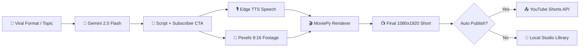

<div align="center">

# 🎬 Helios Studio

### AI-Powered YouTube Shorts Video Generator & Automation Platform

[](https://fastapi.tiangolo.com/)
[](https://react.dev/)
[](https://vitejs.dev/)
[](https://ai.google.dev/)
[](https://developers.google.com/youtube)

*Generate high-retention scripts, compile vertical 9:16 videos, remix viral content, and automatically publish YouTube Shorts — all from one desktop studio.*

---

</div>

## ✨ Features & Viral Formats

### 🚀 6 High-Converting Viral Shorts Formats
Move away from generic facts with psychological scroll-stopping formats engineered for >90% retention and subscriber conversions:

- 🕵️ **Dark History & Unsolved Mysteries**: Creepy secrets, ancient anomalies, and chilling 2s curiosity hooks.
- 🧠 **Dark Psychology Hacks**: Direct viewer challenges, subconscious tricks, and body language reader tests.
- ⚔️ **Would You Rather & Survival Dilemmas**: High-stakes interactive choices (Scenario A vs B) with forced comment CTAs.
- 🌌 **Sci-Fi "What If?" Scenarios**: Mind-bending hypothetical physics and apocalyptic countdowns.
- 📜 **Reddit Story Plot Twists**: Suspenseful personal storytelling with shocking 3-second twist endings.
- 🎭 **Viral POV Comedy**: Relatable everyday situations, sarcastic advice, and meme punchlines.

---

| Core Feature | Description |
|---|---|
| **🤖 AI Script Studio** | Gemini 2.5 Flash script generation with hook optimization, word count enforcement (50-70 words for 20-30s layout), and subscriber calls-to-action |
| **🔥 Viral Shorts Remixer** | Download trending Shorts, auto-crop to 9:16 vertical format, translate to Hindi Edge TTS narration, compile, and upload to YouTube in one click |
| **🎭 Funny Studio** | Stand-up comedy Shorts generator for POV relatable humor, expectation vs reality, sarcasm, and meme reaction formats |
| **📈 Channel Virality Analytics** | Deeply analyze historical channel video performance, extract success factors, optimal duration ranges, and predict virality scores |
| **🤖 Autopost Automation** | Autonomous background bot that discovers trending keywords, generates high-retention multi-format Shorts, shields against duplicates, and posts on a schedule |
| **🎥 Video Compiler Engine** | Automated video assembly with Edge TTS voices, Pexels vertical stock footage, AI image/video support, and highlighted animated subtitles |
| **📤 YouTube Integration** | One-click OAuth authentication, automated SEO metadata tag generation, category selection, and public/private publishing |
| **📚 Video Library** | Browse, preview, manage, and track upload status of all locally compiled videos |

---

## 🏗️ Architecture

```
videogenerater/
├── backend/                    # Python FastAPI server (port 8000)
│   ├── app/
│   │   ├── main.py             # FastAPI entrypoint & CORS config
│   │   ├── config.py           # Environment & path configuration
│   │   ├── models.py           # Pydantic request/response schemas
│   │   ├── routers/            # API route handlers
│   │   │   ├── video.py        # /api/video/* compilation & generation
│   │   │   ├── youtube.py      # /api/youtube/* OAuth & upload
│   │   │   ├── settings.py     # /api/settings/* API keys
│   │   │   └── automation.py   # /api/automation/* background bot control
│   │   └── services/           # Business logic layer
│   │       ├── ai_service.py         # Gemini API integration & viral prompts
│   │       ├── youtube_service.py    # YouTube Data API v3 & downloader
│   │       ├── automation_worker.py  # Autonomous background task runner
│   │       ├── shorts_remixer.py     # Video downloader, cropper, translator & compiler
│   │       ├── db/                   # SQLite database layer
│   │       └── video/                # Video assembly pipeline
│   │           ├── compiler.py       # MoviePy video assembly & rendering
│   │           ├── speech.py         # Edge TTS voice synthesis
│   │           └── subtitle.py       # Highlighted animated subtitle overlay
│   ├── .env                    # API keys & config
│   ├── requirements.txt        # Python dependencies
│   └── output/                 # Generated MP4 video files
│
├── frontend/                   # React + Vite + Tailwind (port 5173)
│   ├── src/
│   │   ├── App.tsx             # Main layout router
│   │   ├── index.css           # Design system & visual effects
│   │   ├── components/         # Navigation & Shell components
│   │   └── pages/              # Application views
│   │       ├── Dashboard.tsx         # Channel overview & metrics
│   │       ├── Generator.tsx         # Video Studio with 6 Viral Format Selectors
│   │       ├── ViralRemixer.tsx      # One-click YouTube video remixer
│   │       ├── FunnyStudio.tsx       # Dedicated comedy & POV creator
│   │       ├── ViralAnalytics.tsx    # Channel analysis & virality report
│   │       ├── AutopostAutomation.tsx # Background scheduler & terminal logs
│   │       ├── Library.tsx           # Local video gallery
│   │       └── Settings.tsx          # API credentials & YouTube account connection
│   └── package.json
│
├── run_servers.py              # Orchestrator — launches backend + frontend
├── start.bat                   # Windows one-click launcher
└── database.db                 # SQLite persistent database
```

---

## 🚀 Quick Start

### Prerequisites

- **Python 3.10+** with `pip`
- **Node.js 18+** with `npm`
- **ImageMagick** (required by MoviePy for subtitle text rendering — [download](https://imagemagick.org/script/download.php))

### 1. Installation

**Backend setup:**
```bash
cd backend
python -m venv venv
venv\Scripts\activate        # Windows
# source venv/bin/activate   # macOS/Linux
pip install -r requirements.txt
```

**Frontend setup:**
```bash
cd frontend
npm install
```

### 2. Configure API Keys

Edit `backend/.env` or set credentials in the **Settings** page:

```env
# Required — AI script generation
GEMINI_API_KEY=your_gemini_key

# Required — Stock footage for background videos
PEXELS_API_KEY=your_pexels_key

# Optional — AI image/video generation
REPLICATE_API_TOKEN=your_replicate_token

# Optional — YouTube upload & channel analytics
YOUTUBE_CLIENT_ID=your_client_id
YOUTUBE_CLIENT_SECRET=your_client_secret
```

| Service | Get API Key | Status |
|---|---|---|
| **Gemini** | [Google AI Studio](https://aistudio.google.com/) | ✅ Required |
| **Pexels** | [Pexels API](https://www.pexels.com/api/) | ✅ Required |
| **YouTube** | [Google Cloud Console](https://console.cloud.google.com/) | ⬜ Optional |

### 3. Run Studio

**Windows One-Click:**
```bash
start.bat
```

**Manual Launcher:**
```bash
python run_servers.py
```

- **Backend Server:** `http://localhost:8000`
- **Frontend Studio:** `http://localhost:5173`

---

## 🔄 Automated Video Pipeline



---

## 🛠️ Tech Stack

### Backend
- **FastAPI**: Asynchronous Python API framework
- **MoviePy 2.0 & ImageMagick**: 9:16 vertical rendering, clip splicing, and subtitle overlays
- **Edge TTS**: Multi-speaker neural text-to-speech engine
- **Google Gemini 2.5 Flash**: High-speed AI script generation and YouTube SEO metadata optimization
- **YouTube Data API v3**: Authenticated channel analytics and video publishing
- **SQLite**: Local database for duplicate shields, automation worker state, and video history

### Frontend
- **React 19 & Vite 8**: Ultra-fast component rendering and HMR
- **TypeScript**: Full type safety
- **Tailwind CSS 3**: Dark glassmorphism UI system

---

## 📄 License

Distributed under the MIT License. Built with ❤️ for automated YouTube channel growth.
